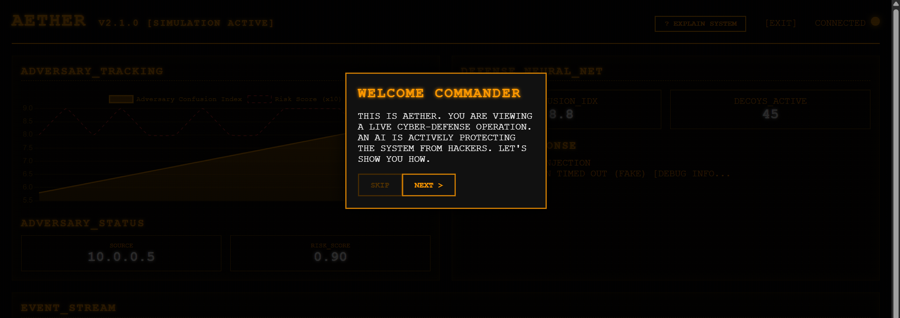
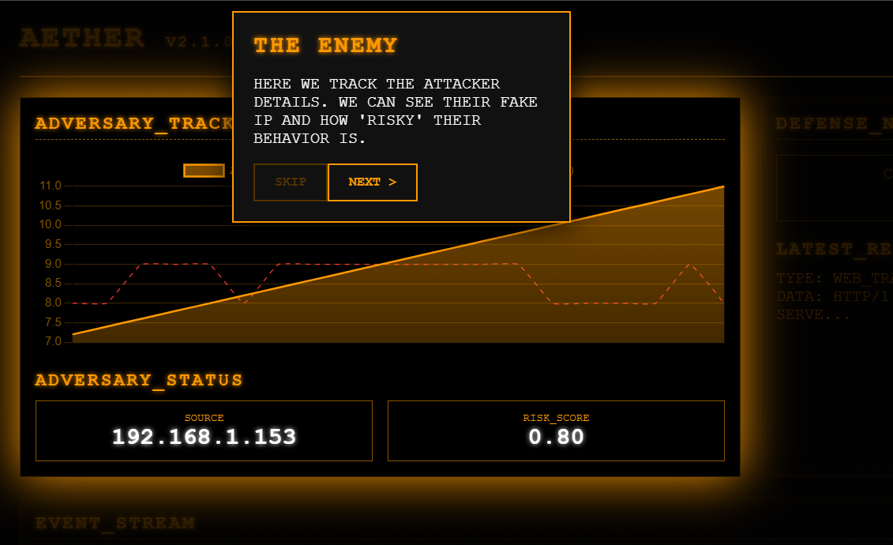
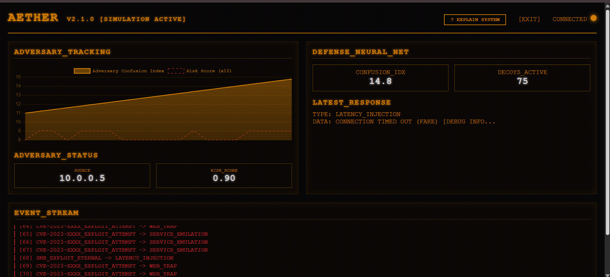
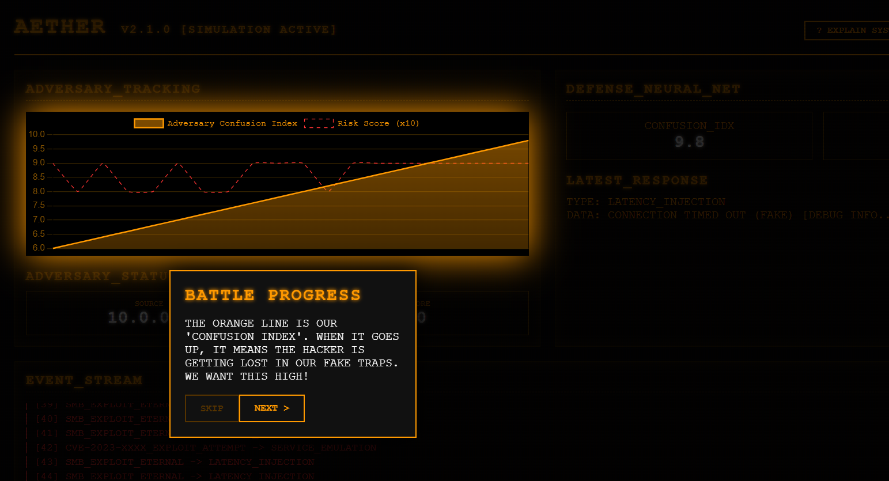
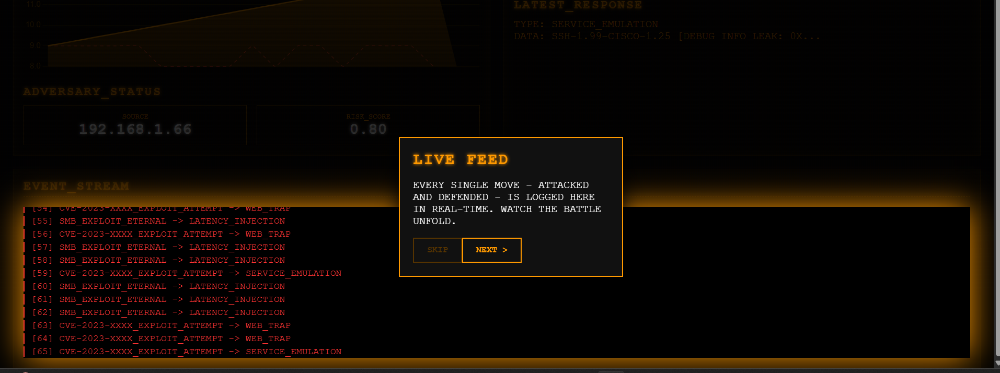
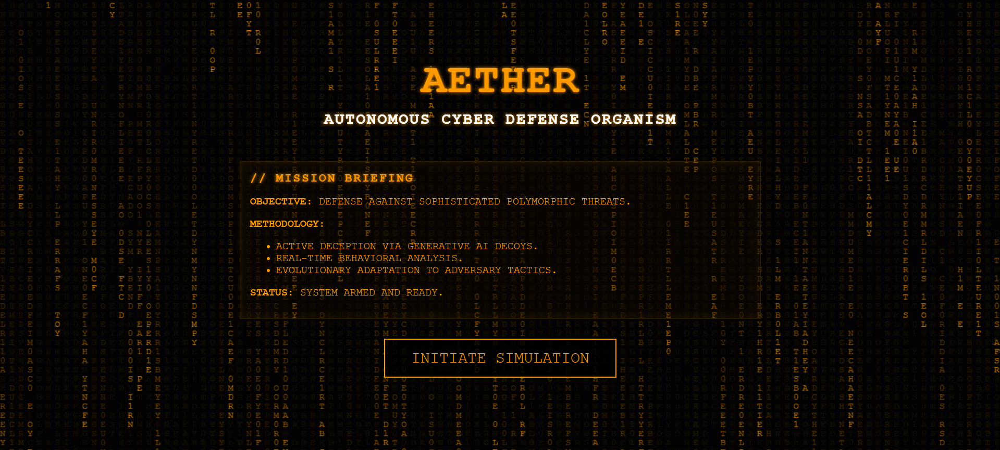

# AETHER: Autonomous, Evolving, Tamper-proof Honeypot Ecosystem with Reactive Intelligence

[](https://www.techrxiv.org/users/938624/articles/1308701-aether-autonomous-evolving-tamper-proof-honeypot-ecosystem-with-reactive-intelligence)



AETHER is a next-generation, deception-centric cyber defense organism designed to neutralize advanced persistent threats (APTs) through **Reactive Intelligence** and **Dynamic Digital Illusions**. Unlike traditional static honeypots, AETHER evolves its complexity in real-time based on adversary behavior.

## 🔬 Scientific Foundation

AETHER shifts the paradigm from **Passive Detection** to **Active Engagement**. Most honeypots are static decoys that are easily identified by sophisticated actors. AETHER implements an "Evolutionary Deception" model.


### Core Paradigms
- **Reactive Intelligence**: The system analyzes tactical intent and generates context-aware responses.
- **Synthesized Illusions**: Leveraging generative principles to create fake banners, error messages, and data leaks.
- **Tamper-Proof Architecture**: Core logic is decoupled from the deception surface.

## 🧮 Mathematical Framework

AETHER's decision engine is modeled as a state-space transition system.

### 1. The Interaction State Vector ($s_t$)

$$
s_t = \{P, I, \Sigma, \mathcal{B}\}
$$

### 2. Generative Deception Function ($G_{\phi}$)

$$
I_t = G_{\phi}(s_t, z)
$$

### 3. Adversary Confusion Index (ACI)

$$
\mathcal{C}_{t+1} = \mathcal{C}_t + \alpha \cdot \Delta \mathcal{K}
$$

## 🔄 The AETHER Process

The system follows a continuous loop of detection, analysis, and deception.


### Step-by-Step Working:

1.  **Adversary Initialization**: The system detects an incoming threat actor (Attacker).
    
2.  **Behavioral Analysis**: AETHER analyzes the attack vector and assigns a maliciousness score.
3.  **Dynamic Engagement**: The orchestrator deploys context-aware decoys.
    
4.  **Real-time Monitoring**: The defense progress is tracked via the AETHER Dashboard.
    
5.  **Live Intelligence**: All interactions are logged in a live telemetry feed for forensic analysis.
    

## 🏗️ Architecture

AETHER is composed of three primary modules:
1.  **AETHER Core (Orchestrator)**
2.  **Generative Decoy Module (The Illusionist)**
3.  **Behavioral Analysis Engine**



## 🚀 Getting Started

### Prerequisites
```bash
pip install flask
```

### Running the System
```bash
# Dashboard
python app.py

# CLI Simulation
python main.py
```

## 📚 Research & Publication

Our core research on the AETHER ecosystem is detailed in our latest publication. You can access the paper using the links below.

<div align="center">
  <a href="docs/AETHER__Autonomous__Evolving__Tamper_proof_Honeypot_Ecosystem_with_Reactive_Intelligence%20(final).pdf">
    
  </a>
  <br>
  <i>Click the button above to open the research paper in GitHub's native viewer.</i>
</div>

[](docs/AETHER__Autonomous__Evolving__Tamper_proof_Honeypot_Ecosystem_with_Reactive_Intelligence%20(final).pdf)

> [!TIP]
> **Citation**: Singh, G., & Singh, M. (2025). *AETHER: Autonomous, Evolving, Tamper-proof Honeypot Ecosystem with Reactive Intelligence*. TechRxiv. 
> [**Read on TechRxiv**](https://www.techrxiv.org/users/938624/articles/1308701-aether-autonomous-evolving-tamper-proof-honeypot-ecosystem-with-reactive-intelligence) | [**View Local PDF**](docs/AETHER__Autonomous__Evolving__Tamper_proof_Honeypot_Ecosystem_with_Reactive_Intelligence%20(final).pdf)

---
*Developed with Reactive Intelligence for the next generation of Cyber-Defensive Organisms.*

